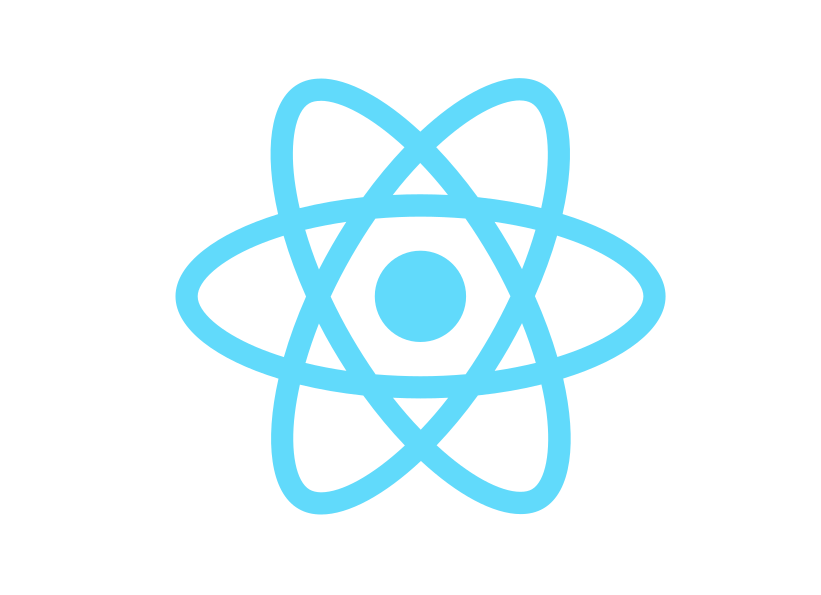

<h1 align="center"> :hibiscus: <a href="https://boilerplate-react-ts.web.app/">React Boilerplate</a></h1>
<div align="center">
    
    
    
    
</div>

This is a solid React + Typescript Boilerplate, using [Webpack](https://webpack.js.org/) and [Babel](https://babeljs.io/), with [`CSS Modules`](https://github.com/css-modules/css-modules), [`SASS`](https://sass-lang.com/) and traditional CSS stylesheets. Supports [React-Router](https://reactrouter.com) and [Redux-Toolkit](https://redux-toolkit.js.org/) too!

This boilerplate also uses a [webapck dashboard](https://github.com/FormidableLabs/webpack-dashboard) provided by [FormidableLabs](https://github.com/FormidableLabs), which makes you feel like you work at NASA! :neckbeard:

## :star2: Features

This boilerplate has a lot of features, some worth mentioning are:

- Change the theme with the click of a button!
- [TypeScript](https://www.typescriptlang.org/) support
- React-Router and Redux Toolkit support
- CSS Modules and SASS support
- [React Refresh for Webpack](https://github.com/pmmmwh/react-refresh-webpack-plugin)
- [Dotenv for Webpack](https://github.com/mrsteele/dotenv-webpack)
- [ESLint](https://eslint.org/)
- [Prettier](https://prettier.io/)
- [Husky](https://github.com/typicode/husky) with [lint-staged](https://github.com/okonet/lint-staged)
- [Webpack Bundle Analyzer](https://github.com/webpack-contrib/webpack-bundle-analyzer)
- [Docker](https://www.docker.com/) support added in [v2.0.1](https://github.com/sydrawat/react-boilerplate/releases/tag/v2.0.1)!
- [Atomic Design](https://bradfrost.com/blog/post/atomic-web-design/) as described by [Brad Frost](https://bradfrost.com/), is followed in this boilerplate. It is highly opinionated, and hence the boilerplate structure is very flexible, adjustable according to you requirements.
- Improved styles with atomic design approach with SASS for reference.
- Redux Thunk example for fetching posts from [JSON Placeholder](https://jsonplaceholder.typicode.com/).

## :arrow_heading_down: Installation

- Install the boilerplate using the following command:

```shell
  npx degit https://github.com/sydrawat/react-boilerplate my-app
```

> Please note that you'll need the [degit](https://www.npmjs.com/package/degit) package pre-installed on your system. If you do not have it installed beforehand, it automatically prompts you to install the package when you run the above command.

- You'll need to install the dependencies as well:

```shell
  #for yarn users
  yarn
  #for npm users
  npm i
```

## :microscope: Usage

If you do not want to install the template using a third party package, you can do so by downloading this boilerplate manually from here. Here's how to do so:

- Clone the repository

```shell
  git clone https://github.com/sydrawat/react-boilerplate.git my-app
```

- Run the following command

```shell
  #for yarn users
  yarn
  #for npm users
  npm i
```

## :construction: Development

To run the development server, run the following command:

```shell
  #for yarn users
  yarn start
  #for npm users
  npm run start
```

> This serves the app on `localhost:3000` via the webpack-dev-server package.

## :rocket: Build

- Run the following command to build your project for production:

```shell
  #for yarn users
  yarn build
  #for npm users
  npm run build
```

- To see bundle info from [Webpack Bundle Analyzer](https://github.com/webpack-contrib/webpack-bundle-analyzer) plugin, use the following command(s):

```shell
  #for yarn users
  yarn build:info
  #for npm users
  npm run build:info
```

> Bundle info will be shown on `localhost:3001`. This will open automatically in your preferred browser when you run the above command(s).

- To see the app in prodution mode, navigate to the `build/` folder that is generated after running the above command. This will serve the production ready app to `localhost:5000`.

```shell
  cd build/;
  npx serve
```

## :whale: Docker

If you wish to **_dockerise_** your project, and make it available as a docker image at [docker hub](https://hub.docker.com/), you can do so with a few simple commands!

### Development

To test the application as a docket container in development mode, we need to simply run the following command(s):

- To create a docker image that will run a container, use:

```shell
  docker-compose build
```

- Once the above command completes it's execution, we can now run either of the following commands:

  - **_No-strings-attached_** dev server:

  ```shell
    docker-compose up
    # Or, to run in detached mode (i.e, in the background)
    docker-compose up -d
  ```

  - To see the cool `webpack-dashboard`:

  ```shell
    docker-compose run -p 3000:3000 dev
  ```

  - To peform cleanup:

  ```shell
    docker-compose down
  ```

### Deploy on [Docker Hub](https://hub.docker.com/)

To deploy or `push` your project docker image to the [docker hub](https://hub.docker.com/), use the following set of command(s):

```shell
  docker build -t <username>/<repository>:<tag> .
  docker tag <username>/<repository>:<tag> <username>/<repository>:latest
  docker push <username>/<repository>:<tag>

  # It might look something like this:
  docker build -t user/app:v1.0.0 .
  docker tag user/app:v1.0.0 user/app:latest
  docker push user/app:v1.0.0
```

If all went well, your image will now be live on Docker Hub and it will be easy to share.

### Next Steps

At this point, I can see that my application is running from a docker container locally, and I have that image on Docker Hub, so that's a big portion of the battle. From here, there are two more issues to cover:

- [ ] Setting up a continuous integration tool to test and deploy code
- [x] Setting up a production server to receive and serve code (maybe change it from Firebase to DigitalOcean?)

> :construction: This is still a Work-In-Progress. Please refer to [this issue](https://github.com/sydrawat/react-boilerplate/issues/2) for more details.

## :scroll: License

[](./License)
